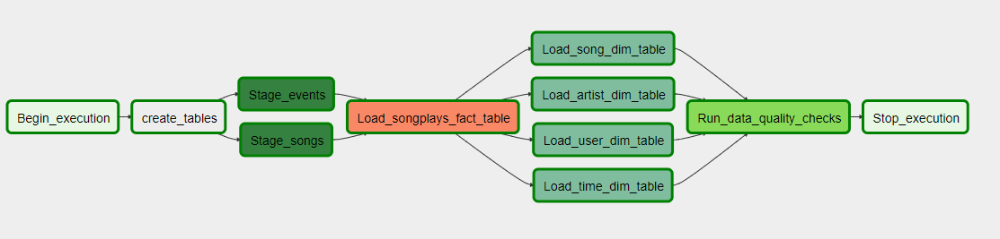
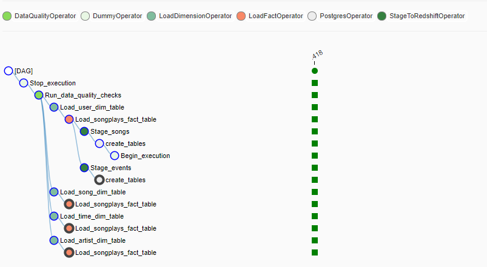

## Automated Data Pipelines with Apache Airflow

### Project origin
Udacity Data Engineering Nanodegree

### Tools and knowledge involved
- Apache Airflow
- Data pipline 
- Data warehouse
- ETL
- Amazon S3
- Amazon Redshift

### Project background
A music streaming company, Sparkify, has decided that it is time to introduce more automation and monitoring to their data warehouse ETL pipelines and come to the conclusion that the best tool to achieve this is Apache Airflow.
They need a data engineer to create high grade data pipelines that are dynamic and built from reusable tasks, can be monitored, and allow easy backfills. They have also noted that the data quality plays a big part when analyses are executed on top the data warehouse and want to run tests against their datasets after the ETL steps have been executed to catch any discrepancies in the datasets.

### Data
The source data resides in S3 and needs to be processed in Sparkify's data warehouse in Amazon Redshift. The source datasets consist of JSON logs that tell about user activity in the application and JSON metadata about the songs the users listen to.

### Files included
- -dags folder
 - data_pipeline_dag.py: main script that automates the the data warehouse ETL and data quality check pipelines.
 - create_table.sql: sql statements used in main script
- -plugins folder
 - -helers folder
   - sql_queries.py: contains insert statements to analytical tables.
 - -operators folder: contains all custom operators used in main script
   - stage_redshift.py
   - load_fact.py
   - load_dimension.py
   - data_quality.py
 
### Data pipeline DAG

### Example of successful pipeline

### How to use
- Set up Apache Airflow and create connections of your own credentials for AWS and Redshift.
- Run the data_pipeline_dag.py.

   	 